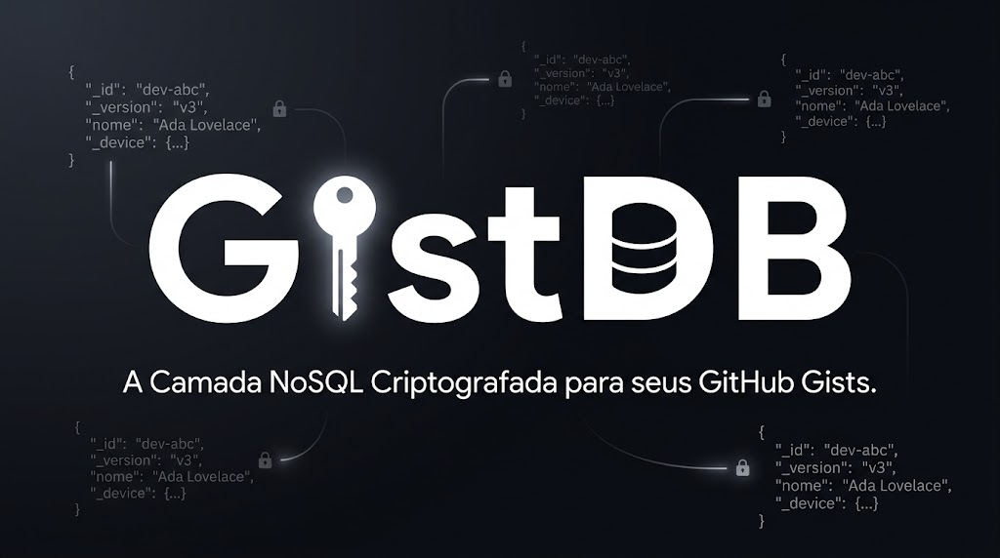

# 🗃️ GistDB


<div align="center">


> **Um banco de dados leve, criptografado e multi-dispositivo, que usa GitHub Gists como backend de persistência.**

</div>

GistDB é uma biblioteca TypeScript que transforma GitHub Gists em um banco de dados NoSQL funcional. Ideal para projetos pessoais, extensões de browser, aplicações Electron e qualquer contexto onde você precise de persistência de dados sem manter infraestrutura própria de servidor. Suporta criptografia AES de ponta a ponta, cache local com TTL, resolução de conflitos, sincronização automática por eventos de browser, rastreamento de dispositivos e observadores reativos via polling.

---

## 📋 Sumário

- [Visão Geral](#-visão-geral)
- [Funcionalidades](#-funcionalidades)
- [Arquitetura](#-arquitetura)
- [Instalação](#-instalação)
- [Configuração](#-configuração)
- [Uso](#-uso)
  - [Inicialização](#inicialização)
  - [CRUD](#crud)
  - [Utilitários de collection](#utilitários-de-collection)
  - [Sincronização](#sincronização)
  - [AutoSync](#autosync)
  - [Dispositivos](#dispositivos)
  - [Observadores (Watch)](#observadores-watch)
- [API Reference](#-api-reference)
- [Tratamento de Erros](#-tratamento-de-erros)
- [Contribuição](#-contribuição)
- [Licença](#-licença)

---

## 🔍 Visão Geral

O GistDB resolve o problema de persistência de dados em aplicações que não podem — ou não querem — depender de um banco de dados dedicado. Usando a API do GitHub Gists como camada de armazenamento, cada registro é salvo como um arquivo `.json` individual dentro de um Gist privado ou público. Todo o acesso passa por uma camada de cache local com TTL configurável, os dados podem ser protegidos com criptografia AES derivada de senha, e cada escrita carrega automaticamente metadados de dispositivo para rastreamento multi-dispositivo.

```
Aplicação → GistDB → [ Cache Local (TTL) ] → GitHub Gist (JSON Files)
                              ↑
                     Criptografia AES (opcional)
                              ↑
                  Metadados de Dispositivo (_device)
```

---

## ✨ Funcionalidades

- **CRUD completo** — `get`, `set`, `update`, `delete`, `list` e `has` por collection
- **Criptografia AES** — cifragem/decifragem transparente via senha; recuperação automática via `salt`
- **Cache local com TTL** — evita chamadas desnecessárias à API do GitHub
- **Resolução de conflitos** — estratégias `last-write-wins`, `merge` ou função customizada
- **Validação de schema** — validadores por collection definidos pelo usuário
- **AutoSync por eventos** — sincronização automática em `visibilitychange`, `online` e `beforeunload`
- **Rastreamento de dispositivos** — cada escrita armazena `_device`; `devices.list()` para inspecionar
- **Observadores reativos** — `watch()` com polling configurável para detectar mudanças remotas
- **Utilitários de limpeza** — `clearCollection()`, `clearCache()` e `clearAll()`
- **Suporte offline** — detecção de `navigator.onLine`; operações offline são enfileiradas
- **Logging estruturado com traceId** — cada operação emite logs com duração e rastreabilidade
- **Gerenciamento seguro de token** — `KeyVault` isola o Personal Access Token em memória
- **Versionamento de registros** — cada registro carrega `_version`, `_id`, `_updatedAt` e `_device`

---

## 🏗️ Arquitetura

```
src/
├── GistDB.ts             # Classe principal (factory + orquestrador)
├── GistAPI.ts            # Cliente HTTP para a API do GitHub Gists
├── GistTransport.ts      # Camada de transporte (leitura/escrita de arquivos no Gist)
├── CryptoManager.ts      # Criptografia AES derivada de senha (PBKDF2)
├── LocalCacheAdapter.ts  # Cache em memória / localStorage com TTL
├── ConflictResolver.ts   # Estratégias de resolução de conflito
├── KeyVault.ts           # Armazenamento seguro do GitHub token em memória
├── DeviceIdentity.ts     # Identificação e metadados do dispositivo atual
├── Logger.ts             # Logger estruturado com traceId e métricas de duração
├── types.ts              # Tipos compartilhados (GistDBConfig, DeviceInfo, etc.)
└── errors.ts             # GistDBError com códigos de erro tipados
```

### Fluxo de uma operação `set`

```
set(collection, id, data)
       │
       ├─► Valida schema (opcional)
       ├─► Detecta modo offline
       ├─► Busca versão remota no Gist (se online)
       ├─► Incrementa versão (_version: vN → vN+1)
       ├─► Injeta _device (DeviceIdentity)
       ├─► Resolve conflito (local vs. remote)
       ├─► Criptografa payload (se senha configurada)
       ├─► Persiste no GitHub Gist via GistTransport
       ├─► Atualiza cache local
       └─► Notifica watchers
```

### Fluxo de AutoSync

```
autoSync: true  →  escuta eventos de browser
       │
       ├─► visibilitychange (tab voltou ao foco) → sync()
       ├─► online (reconexão de rede)            → sync()
       └─► beforeunload (fechamento da aba)      → sync()
```

---

## 📦 Instalação

```bash
# npm
npm install gistdb

# yarn
yarn add gistdb

# pnpm
pnpm add gistdb
```

> **Requisitos:** Node.js ≥ 18 ou ambiente de browser moderno com suporte a `SubtleCrypto` e `fetch`.

---

## ⚙️ Configuração

Antes de usar, você precisa de um **GitHub Personal Access Token (PAT)** com o escopo `gist`.

1. Acesse [github.com/settings/tokens](https://github.com/settings/tokens)
2. Clique em **Generate new token (classic)**
3. Marque o escopo **`gist`**
4. Copie o token gerado

> ⚠️ Nunca exponha seu token em código client-side público. Use variáveis de ambiente.

---

## 🚀 Uso

### Inicialização

```typescript
import { GistDB } from './GistDB.js';

const db = await GistDB.create({
  token: process.env.GITHUB_TOKEN!,    // Seu PAT com escopo "gist"
  prefix: 'meu-app',                   // Prefixo único para isolar dados
  password: 'senha-secreta',           // Opcional: habilita criptografia AES
  gistId: 'abc123',                    // Opcional: reutiliza um Gist existente
  ttl: 5 * 60 * 1000,                  // Cache local em ms (padrão: 5 min)
  conflictResolver: 'last-write-wins', // 'last-write-wins' | 'merge' | fn
  autoConnect: true,                   // Inicializa conexão imediatamente (padrão: true)
  autoSync: true,                      // Habilita sync automático por eventos de browser
  deviceName: 'Meu Laptop',            // Nome amigável para este dispositivo
  schema: {
    usuarios: (data) => typeof data.nome === 'string' && data.nome.length > 0,
  },
});
```

| Parâmetro          | Tipo                                       | Obrigatório | Descrição                                                         |
|--------------------|--------------------------------------------|:-----------:|-------------------------------------------------------------------|
| `token`            | `string`                                   | ✅          | GitHub Personal Access Token (escopo `gist`)                      |
| `prefix`           | `string`                                   | ✅          | Prefixo único para namespacing das collections                    |
| `gistId`           | `string \| null`                           | ❌          | ID de um Gist existente (cria um novo se omitido)                 |
| `password`         | `string`                                   | ❌          | Senha para criptografia AES dos dados                             |
| `ttl`              | `number`                                   | ❌          | Tempo de vida do cache em ms (padrão: `300000`)                   |
| `conflictResolver` | `'last-write-wins' \| 'merge' \| function` | ❌          | Estratégia de resolução de conflito                               |
| `autoConnect`      | `boolean`                                  | ❌          | Inicializa a conexão ao criar (padrão: `true`)                    |
| `autoSync`         | `boolean \| AutoSyncOptions`               | ❌          | Sync automático por eventos de browser (padrão: `false`)          |
| `deviceName`       | `string`                                   | ❌          | Nome amigável do dispositivo para rastreamento                    |
| `schema`           | `Record<string, (data: any) => boolean>`   | ❌          | Validadores por collection                                        |

#### `autoSync` granular

```typescript
autoSync: {
  onFocus: true,       // Sincroniza quando a aba recupera o foco
  onReconnect: true,   // Sincroniza ao reconectar à rede
  onUnload: true,      // Sincroniza antes de fechar a aba
}
```

---

### CRUD

```typescript
// Criar / substituir um registro
const result = await db.set('usuarios', 'user-1', {
  nome: 'Ada Lovelace',
  email: 'ada@example.com',
});
// → { id: 'user-1', version: 'v1', updatedAt: '2024-...' }

// Atualização parcial (merge com dados existentes)
await db.update('usuarios', 'user-1', { email: 'novo@example.com' });

// Ler um registro
const usuario = await db.get('usuarios', 'user-1');
// → { nome: 'Ada Lovelace', email: 'novo@example.com', _id: 'user-1', _version: 'v2', _device: {...}, ... }

// Verificar existência sem carregar o dado completo
const existe = await db.has('usuarios', 'user-1');
// → true

// Listar todos os registros de uma collection (com filtro opcional)
const ativos = await db.list('usuarios', (u) => u.ativo === true);

// Deletar um registro
await db.delete('usuarios', 'user-1');
// → true
```

> **`set` vs `update`:** `set` substitui o registro inteiro; `update` faz merge dos campos informados com os dados existentes. Se o registro não existir, `update` lança `NOT_FOUND`.

---

### Utilitários de collection

```typescript
// Remove todos os registros de uma collection específica
await db.clearCollection('usuarios');

// Limpa apenas o cache local (dados remotos preservados)
await db.clearCache();

// Remove TUDO: cache local + todos os arquivos do Gist
await db.clearAll();
```

---

### Sincronização

```typescript
// Força limpeza do cache e flush da fila de escritas pendentes
const { syncedAt } = await db.sync();

// Verifica quando ocorreu a última sincronização
const lastSync = await db.getLastSyncAt();
```

---

### AutoSync

Quando `autoSync: true` (ou com opções granulares), o GistDB registra listeners de browser automaticamente e os remove no `destroy()`:

```typescript
const db = await GistDB.create({
  token: '...',
  prefix: 'app',
  autoSync: {
    onFocus: true,      // sync ao voltar para a aba
    onReconnect: true,  // sync ao reconectar à internet
    onUnload: false,    // não sincroniza ao fechar
  },
});

// Ao fechar a aplicação, limpa listeners e recursos
db.destroy();
```

---

### Dispositivos

O GistDB registra automaticamente o dispositivo atual na collection reservada `__devices__` a cada inicialização. Use `devices.list()` para inspecionar quais dispositivos acessaram o banco:

```typescript
const lista = await db.devices.list();
// → [
//     { id: 'dev-abc', name: 'Meu Laptop', platform: 'MacIntel', lastSeenAt: '...', isCurrent: true },
//     { id: 'dev-xyz', name: 'Trabalho',   platform: 'Win32',    lastSeenAt: '...', isCurrent: false },
//   ]

// ID do dispositivo atual
console.log(db.deviceId); // → 'dev-abc'
```

Cada registro escrito via `set()` ou `update()` inclui automaticamente o campo `_device` com os metadados do dispositivo de origem.

---

### Observadores (Watch)

```typescript
// Observa mudanças em uma collection via polling (padrão: 30s)
const unsubscribe = db.watch('usuarios', (id, data) => {
  if (data === null) {
    console.log(`Usuário ${id} foi deletado`);
  } else {
    console.log(`Usuário ${id} atualizado:`, data);
  }
}, 15_000); // polling a cada 15 segundos

// Cancela a observação
unsubscribe();

// Destrói a instância: limpa watchers, polling intervals, autoSync e KeyVault
db.destroy();
```

---

## 📚 API Reference

### `GistDB.create(options)` → `Promise<GistDB>`

Factory assíncrono. **Único ponto de entrada** para criar uma instância do GistDB. Lança `GistDBError` se `token` ou `prefix` não forem fornecidos. Registra o dispositivo atual silenciosamente na collection `__devices__`.

---

### `db.get(collection, id)` → `Promise<any | null>`

Retorna o registro pelo `id`. Usa cache local quando disponível. Retorna `null` se não encontrado. Emite logs com duração e `traceId`.

---

### `db.set(collection, id, data)` → `Promise<{ id, version, updatedAt }>`

Cria ou substitui um registro. Injeta `_device`, aplica validação, resolução de conflito e criptografia. Funciona offline (enfileira escritas).

---

### `db.update(collection, id, partialData)` → `Promise<{ id, version, updatedAt }>`

Atualização parcial: faz merge de `partialData` com o registro existente. Lança `NOT_FOUND` se o registro não existir.

---

### `db.has(collection, id)` → `Promise<boolean>`

Verifica a existência de um registro via cache ou chamada remota. Não retorna os dados.

---

### `db.delete(collection, id)` → `Promise<boolean>`

Remove o arquivo do Gist e invalida o cache. Notifica watchers com `data = null`.

---

### `db.list(collection, filterFn?)` → `Promise<any[]>`

Lista todos os registros de uma collection com filtro opcional `(item: any) => boolean`.

---

### `db.clearCollection(collection)` → `Promise<void>`

Remove todos os registros de uma collection do Gist e invalida o cache correspondente.

---

### `db.clearCache()` → `Promise<void>`

Limpa apenas o cache local. Os dados no Gist remoto são preservados.

---

### `db.clearAll()` → `Promise<void>`

Remove o cache local e todos os arquivos do Gist. Operação destrutiva e irreversível.

---

### `db.sync()` → `Promise<{ syncedAt: string }>`

Limpa o cache local e envia escritas pendentes ao GitHub. Grava o timestamp em `__meta__`.

---

### `db.getLastSyncAt()` → `Promise<string | null>`

Retorna o timestamp ISO da última sincronização bem-sucedida ou `null`.

---

### `db.watch(collection, callback, interval?)` → `() => void`

Registra um observador via polling. O `callback` recebe `(id: string, data: any | null)`. Retorna função para cancelar.

---

### `db.devices.list()` → `Promise<DeviceInfo[]>`

Lista todos os dispositivos que já acessaram o banco, com o campo `isCurrent` marcado para o dispositivo ativo.

---

### `db.deviceId` → `string`

Getter que retorna o ID do dispositivo atual.

---

### `db.destroy()` → `void`

Cancela polling intervals, limpa watchers, remove listeners de autoSync e apaga o token do `KeyVault`.

---

## ⚠️ Tratamento de Erros

O GistDB lança instâncias de `GistDBError` com códigos semânticos:

```typescript
import { GistDBError } from './errors.js';

try {
  await db.update('usuarios', 'inexistente', { email: 'x' });
} catch (err) {
  if (err instanceof GistDBError) {
    console.error(err.code);    // 'NOT_FOUND'
    console.error(err.message); // 'Registro não encontrado para update em usuarios/inexistente.'
  }
}
```

| Código             | Causa                                              |
|--------------------|----------------------------------------------------|
| `TOKEN_REQUIRED`   | Nenhum token fornecido ao `create()`               |
| `PREFIX_REQUIRED`  | Nenhum prefix fornecido ao `create()`              |
| `NOT_INITIALIZED`  | Método chamado antes de `gistId` ser configurado   |
| `VALIDATION_ERROR` | Dados rejeitados pelo validador de schema          |
| `NOT_FOUND`        | `update()` chamado para um registro inexistente    |

---

## 🤝 Contribuição

Contribuições são bem-vindas! Siga os passos abaixo:

1. Faça um **fork** do repositório
2. Crie uma branch para sua feature: `git checkout -b feat/minha-feature`
3. Implemente suas mudanças com testes
4. Abra um **Pull Request** descrevendo o que foi alterado e o motivo

### Padrões do projeto

- TypeScript estrito com `private class fields` (`#`)
- Erros sempre lançados via `GistDBError` com código semântico
- Logs via `Logger` com `traceId` (nunca `console.log` direto em produção)
- Funções assíncronas com tipos de retorno explícitos
- Tipos compartilhados centralizados em `types.ts`

---

## 📄 Licença

Distribuído sob a licença **MIT**. Consulte o arquivo [`LICENSE`](./LICENSE) para mais detalhes.

---

<p align="center">
  Feito com ☕ e TypeScript &nbsp;·&nbsp; GitHub Gists como banco de dados nunca foi tão simples.
</p>