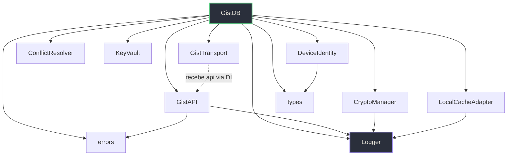

# 📁 Code Review v2 — GistDB SDK

**Data:** 2026-08-29
**Revisão anterior:** 2026-08-XX (v1)
**Total de linhas:** 3.876 (11 módulos src + 9 arquivos de teste + playground)
**Linguagem:** TypeScript (ESM)
**Tipo:** Biblioteca/SDK browser-first para usar GitHub Gists como banco de dados

---

## Visão Geral

SDK TypeScript zero-dependências que transforma GitHub Gists em um banco NoSQL com criptografia AES-GCM, cache local com TTL (IndexedDB/sessionStorage), resolução de conflitos, fila offline, observabilidade estruturada e identidade de dispositivo. Desde o review v1, o projeto migrou de JS para TS, adicionou Logger, DeviceIdentity, autoSync e autoConnect.

---

## 🏗️ Arquitetura

### Grafo de Dependências



> Sem dependências circulares. ✅ GistDB é o hub central (esperado como fachada).

### Pontos Críticos

1. **`GistDB.ts` está sobrecarregado (484 linhas)**
   O arquivo acumula: factory pattern, CRUD, sync, watch/polling, autoSync lifecycle, device registration, crypto fallback/restore, validação e notificação de watchers. Responsabilidades demais para um único arquivo.
   - **Impacto:** Difícil de testar unitariamente, alto risco ao modificar.

2. **`#maybeDecrypt` é um labirinto de 40+ linhas com 4 níveis de try/catch aninhados**
   ([`GistDB.ts` L373-L427](file:///mnt/h/programação%20-%20copia/projetos/lib/util/gistdb-sdk/src/GistDB.ts#L373-L427))
   Tenta decrypt → se falha, tenta restore via salt → se restore funciona, tenta verify → se verify passa, tenta decrypt de novo → senão retorna raw. Cada branch tem seu próprio try/catch com Logger.warn. A complexidade ciclomática é altíssima.

3. **`AbortController` criado mas nunca conectado no `#retry`**
   ([`GistTransport.ts` L152-L164](file:///mnt/h/programação%20-%20copia/projetos/lib/util/gistdb-sdk/src/GistTransport.ts#L152-L164))
   ```typescript
   const controller = new AbortController();
   const timer = setTimeout(() => controller.abort(), this.#timeout);
   // controller.signal NUNCA é passado para fn()
   ```
   O timeout declarado no construtor (`timeout: 8_000`) é **inoperante**. As requests podem travar indefinidamente.

4. **`sync()` nunca grava `lastSyncAt` mas `getLastSyncAt()` espera encontrá-lo**
   ([`GistDB.ts` L239-L244](file:///mnt/h/programação%20-%20copia/projetos/lib/util/gistdb-sdk/src/GistDB.ts#L239-L244))
   ```typescript
   async sync() {
     await this.#cache!.clear();        // limpa TUDO
     await this.#transport!.flushQueue();
     return { syncedAt: new Date().toISOString() };
     // ↑ não persiste syncedAt no cache
   }
   async getLastSyncAt() {
     const meta = await this.#cache!.read(`${this.#prefix}:__meta__`);
     return meta?.data?.lastSyncAt ?? null;  // sempre null
   }
   ```
   `getLastSyncAt()` é uma função morta — sempre retorna `null`.

5. **Testes NÃO testam a classe real `GistDB`**
   O arquivo [`GistDB.test.ts`](file:///mnt/h/programação%20-%20copia/projetos/lib/util/gistdb-sdk/__tests__/GistDB.test.ts) cria um `makeTestDB()` que é uma re-implementação inline. Importa `ConflictResolver` e `LocalCacheAdapter` reais (melhoria vs v1), mas o core `GistDB` com sua factory, `#maybeDecrypt`, `#setupAutoSync`, device registration, etc. continua **sem cobertura de teste real**.

6. **`types.ts` diverge das implementações reais**
   | Interface em `types.ts` | Implementação real | Divergência |
   |---|---|---|
   | `CacheEntry { value, timestamp }` | `LocalCacheAdapter { data, cachedAt }` | Nomes incompatíveis |
   | `CryptoPayload { cipher, iv }` | `CryptoManager { ciphertext, iv, salt, __encrypted }` | Campos diferentes |
   | `GistDBConfig.encryption` | `GistDB.create({ password })` | `encryption` não existe na factory |
   | `GistDBConfig.logger` | `Logger.subscribe()` | `logger` callback não é usado |

### Recomendações Estruturais

1. **Extrair `#maybeDecrypt` para um módulo `DecryptionPipeline`** com fluxo linear: decrypt → restore → verify → fallback. Cada etapa retorna `{success, data}` em vez de try/catch aninhado.
2. **Conectar o `AbortController.signal` no `#retry`** passando-o para `fn()` como parâmetro, ou aceitar um `signal` na interface de `GistAPI.#req`.
3. **Persistir `lastSyncAt` no cache dentro de `sync()`** para que `getLastSyncAt()` funcione.
4. **Sincronizar `types.ts` com as implementações reais** ou remover interfaces mortas.
5. **Testar a classe `GistDB` real** mockando apenas `fetch` ou `GistAPI`.

---

## 🔄 Consistência

### Inconsistências entre Arquivos

| Padrão | Arquivos A | Arquivos B | Recomendação |
|--------|------------|------------|--------------|
| `@ts-ignore` nos imports | [`GistDB.ts`](file:///mnt/h/programação%20-%20copia/projetos/lib/util/gistdb-sdk/src/GistDB.ts#L1-L5) usa 4× `@ts-ignore` | Todos os outros módulos resolvem tipos corretamente | Corrigir tipos dos imports ou declarar tipos de módulo |
| Instrumentação Logger | `GistAPI`, `GistDB`, `CryptoManager`, `LocalCache` usam Logger | `ConflictResolver`, `KeyVault`, `DeviceIdentity`, `GistTransport` não usam | Documentar quais módulos são instrumentados ou instrumentar todos |
| Tipos de cache | `types.ts` define `CacheEntry { value, timestamp }` | `LocalCacheAdapter.ts` define `CacheEntry { data, version, cachedAt }` | Unificar ou remover a duplicata em `types.ts` |
| Tratamento de erro nos testes | `GistDB.test.ts` lança `new Error(...)` | Código real lança `new GistDBError(...)` | Usar `GistDBError` nos mocks de teste |
| Dead code | `__tests__/support/helpers.js` (325 linhas) | **Nenhum** arquivo de teste importa `helpers.js` | Remover arquivo morto |
| JSDoc | Módulos pequenos (`errors.ts`, `KeyVault.ts`, `ConflictResolver.ts`) documentados | `GistDB.ts` quase sem JSDoc nos métodos públicos (`get`, `set`, `delete`, `list`) | Adicionar JSDoc nos métodos da fachada pública |

---

## 📄 Review por Arquivo

#### [`src/GistDB.ts`](file:///mnt/h/programação%20-%20copia/projetos/lib/util/gistdb-sdk/src/GistDB.ts)
**Resumo:** Fachada principal do SDK. Factory pattern via `static create()`, orquestra transporte, cache, crypto, conflitos, device identity, autoSync e watchers.
**Críticas:**
- 4× `// @ts-ignore` nos imports — mascaram erros de tipo ao invés de resolvê-los.
- `#maybeDecrypt` com 4 níveis de try/catch aninhados — complexidade ciclomática excessiva.
- O getter `devices` retorna um objeto literal novo a cada acesso (`db.devices === db.devices` é `false`).
- `set()` tem ~50 linhas com responsabilidades misturadas (validação, versioning, remote fetch, conflict resolution, encrypt, transport, cache, notify).
- `sync()` não persiste `lastSyncAt`, tornando `getLastSyncAt()` uma função morta.
- `#pollCollection` captura erro globalmente com `.catch(() => [])` — se um item falha, todos são descartados silenciosamente.
- O construtor é público mas deveria ser `private` ou lançar erro se chamado fora da factory.
**Sugestões:**
- Extrair `#maybeDecrypt` para pipeline linear.
- Cachear o objeto `devices` como propriedade privada instanciada uma vez.
- Dividir `set()` em etapas: `#resolveVersion()`, `#resolveConflict()`, `#persistAndNotify()`.
- Marcar o construtor como privado: `private constructor() {}`.
**Comentários:** JSDoc presente apenas no método `create()` e em `watch()`. Os métodos públicos `get()`, `set()`, `delete()`, `list()`, `sync()` não têm documentação.

---

#### [`src/GistAPI.ts`](file:///mnt/h/programação%20-%20copia/projetos/lib/util/gistdb-sdk/src/GistAPI.ts)
**Resumo:** Wrapper HTTP para a GitHub Gist REST API. Responsabilidade única: mapear operações para HTTP com headers e tratamento de status.
**Críticas:**
- `#req` retorna `null` silenciosamente para 404, o que pode causar bugs sutis em callers que esperam sempre um objeto.
- Status 422 e 403 lançam erro sem incluir o body da resposta do GitHub (perde detalhes de debugging).
- O tipo de `files` em `createGist` é `Record<string, any>` — muito genérico.
**Sugestões:**
- Incluir `await res.text()` no body dos erros 422/403 para diagnóstico.
- Tipar `files` como `Record<string, { content: string }>`.
**Comentários:** Bem documentados com JSDoc conciso. ✅

---

#### [`src/GistTransport.ts`](file:///mnt/h/programação%20-%20copia/projetos/lib/util/gistdb-sdk/src/GistTransport.ts)
**Resumo:** Camada de resiliência sobre GistAPI com retry exponencial, timeout (inoperante) e fila offline IndexedDB/sessionStorage.
**Críticas:**
- **Bug:** `AbortController` criado em `#retry` nunca conecta o `signal` ao `fn()` — o timeout é dead code.
- `initGist()` cria um `gistdb_manifest.json` estruturado (melhoria vs v1). ✅
- A fila offline agora usa IndexedDB com fallback para sessionStorage (melhoria vs v1). ✅
- `flushQueue` processa operações sequencialmente — seguro para ordem, mas lento.
**Sugestões:**
```typescript
async #retry<T>(fn: (signal: AbortSignal) => Promise<T>, attempt = 0): Promise<T> {
  const controller = new AbortController();
  const timer = setTimeout(() => controller.abort(), this.#timeout);
  try {
    const result = await fn(controller.signal);
    clearTimeout(timer);
    return result;
  } catch (err) {
    clearTimeout(timer);
    if (attempt >= this.#retries) throw err;
    // ...
  }
}
```
**Comentários:** Comentários adequados na fila offline. O nome da constante `IDB_QUEUE_STORE` agora é preciso (era `IDB_QUEUE` com localStorage no v1). ✅

---

#### [`src/CryptoManager.ts`](file:///mnt/h/programação%20-%20copia/projetos/lib/util/gistdb-sdk/src/CryptoManager.ts)
**Resumo:** Criptografia AES-GCM via Web Crypto API nativa. Derivação de chave com PBKDF2 (310k iterações).
**Críticas:**
- `_salt` é marcado como `public` — expõe estado interno por conveniência de teste. Deveria usar um getter.
- `encrypt()` faz `this._salt!` (non-null assertion) sem verificar — crash se salt for null por algum motivo.
- `analyzePayload()` é método de debug em código de produção — deveria ser documentado como tal ou removido do bundle.
**Sugestões:**
- Substituir `public _salt` por `get salt(): Uint8Array | null { return this._salt; }`.
- Guard check antes do `!`: `if (!this._salt) throw new Error('Salt not initialized')`.
**Comentários:** Documentação JSDoc completa em todos os métodos. ✅

---

#### [`src/LocalCacheAdapter.ts`](file:///mnt/h/programação%20-%20copia/projetos/lib/util/gistdb-sdk/src/LocalCacheAdapter.ts)
**Resumo:** Cache local com TTL, fingerprint de versão. IndexedDB quando disponível, fallback sessionStorage.
**Críticas:**
- **Condição de corrida corrigida** — agora todos os métodos fazem `await this.#initPromise` antes de operar. ✅
- `clear()` no fallback sessionStorage itera todas as keys — funcional mas O(n) no total de keys.
- A interface `CacheEntry` importada de `types.ts` tem campos diferentes (`value`/`timestamp` vs `data`/`cachedAt`) — o adapter define sua própria `CacheEntry` localmente, o que funciona mas cria confusão.
**Sugestões:**
- Remover `CacheEntry` duplicata de `types.ts` ou unificar.
**Comentários:** Instrumentação com Logger (HIT/MISS/EXPIRED) bem posicionada. ✅

---

#### [`src/Logger.ts`](file:///mnt/h/programação%20-%20copia/projetos/lib/util/gistdb-sdk/src/Logger.ts)
**Resumo:** Singleton de observabilidade com subscriber pattern, traceId, timers e sanitização automática de tokens.
**Críticas:**
- **Bug sutil em `shouldLog()`:** Se um subscriber registra mas `enable()` não foi chamado, o `level` padrão é `'warn'`. Logs `info` e `debug` emitidos por módulos (ex: `Logger.info('GistAPI', ...)`) **não chegam aos subscribers** mesmo que haja um registrado. O level deveria ser independente para subscribers.
- `timeEnd` duplica a duração: coloca `(${durationMs}ms)` na string da mensagem E `durationMs` no meta — a duração aparece duas vezes no log.
- Output para console em `emit()` serializa o record inteiro como JSON para `console.info`, que é interceptado no `playground.html` — cria logs duplicados (um do subscriber, um do console.info interceptado).
**Sugestões:**
```typescript
private shouldLog(lvl: LogLevel) {
  // Subscribers recebem tudo; o filtro de level controla apenas o console
  if (this.handlers.size > 0) return true;
  if (!this.enabled) return false;
  return LEVELS[lvl] <= LEVELS[this.level];
}
```
**Comentários:** Ausência de JSDoc nos métodos. A sanitização é bem implementada.

---

#### [`src/DeviceIdentity.ts`](file:///mnt/h/programação%20-%20copia/projetos/lib/util/gistdb-sdk/src/DeviceIdentity.ts)
**Resumo:** Gera e persiste identificação de dispositivo via `localStorage`, detecta plataforma via `userAgent`.
**Críticas:**
- Em ambientes sem `localStorage` (incognito, SSR), cada sessão gera um UUID novo → cria "ghost devices" na collection `__devices__`.
- `detectPlatform()` é básica mas adequada ao escopo do SDK.
**Sugestões:**
- Documentar na JSDoc que sem `localStorage` a identidade é efêmera.
**Comentários:** Sem JSDoc. Código limpo e focado.

---

#### [`src/ConflictResolver.ts`](file:///mnt/h/programação%20-%20copia/projetos/lib/util/gistdb-sdk/src/ConflictResolver.ts)
**Resumo:** Estratégias de merge para conflitos multi-dispositivo.
**Críticas:**
- `merge` faz `{ ...remote, ...local }` — merge raso. Objetos aninhados são sobrescritos, não mesclados. Pode surpreender o usuário.
- A estratégia `'custom'` no array `valid` é inútil como string literal — só funciona via função no construtor.
**Sugestões:**
- Documentar que `merge` é shallow merge.
- Remover `'custom'` da lista de strings válidas.
**Comentários:** JSDoc presente e preciso. ✅

---

#### [`src/KeyVault.ts`](file:///mnt/h/programação%20-%20copia/projetos/lib/util/gistdb-sdk/src/KeyVault.ts)
**Resumo:** Armazenamento efêmero do token GitHub via base64 em memória + sessionStorage.
**Críticas:**
- `store()` chama `obfuscate()` duas vezes (uma para memória, outra para sessionStorage) — deveria reusar o resultado.
- O comentário diz "armazenamento seguro" mas base64 é trivialmente reversível — não é segurança, apenas ofuscação.
**Sugestões:**
```typescript
store(token: string): void {
  if (!token || typeof token !== 'string') throw new Error('Token inválido.');
  const obfuscated = obfuscate(token);
  _memToken = obfuscated;
  try { sessionStorage?.setItem(SESSION_KEY, obfuscated); } catch {}
}
```
**Comentários:** JSDoc adequado mas misleading ("seguro").

---

#### [`src/errors.ts`](file:///mnt/h/programação%20-%20copia/projetos/lib/util/gistdb-sdk/src/errors.ts)
**Resumo:** Classe de erro tipada com campo `.code` discriminante.
**Críticas:** Nenhuma. Código limpo. ✅
**Comentários:** Bem documentado.

---

#### [`src/types.ts`](file:///mnt/h/programação%20-%20copia/projetos/lib/util/gistdb-sdk/src/types.ts)
**Resumo:** Interfaces de contrato para o SDK.
**Críticas:**
- `GistDBConfig` tem campos que não existem na factory real (`encryption`, `logger`).
- `GistDBConfig` tem JSDoc órfão na linha 19 (`/** Estratégia de resolução de conflitos */`) sem campo correspondente.
- `CacheEntry` e `CryptoPayload` divergem das implementações reais (ver tabela acima).
- `GistDBConfig` não é importado nem usado em `GistDB.ts` — a factory declara tipos inline.
**Sugestões:**
- Sincronizar `GistDBConfig` com os parâmetros reais de `GistDB.create()` ou importar e usar a interface.
- Remover `CacheEntry` e `CryptoPayload` de `types.ts` (já definidos corretamente nos módulos que os usam).

---

#### [`__tests__/GistDB.test.ts`](file:///mnt/h/programação%20-%20copia/projetos/lib/util/gistdb-sdk/__tests__/GistDB.test.ts)
**Resumo:** 12 testes de integração usando mini-DB inline com transport mockado e módulos reais de cache/resolver.
**Críticas:**
- **Não testa a classe real `GistDB`** — o `makeTestDB()` é uma reimplementação que replica o comportamento esperado mas não exerce o código real (factory, `#maybeDecrypt`, `#assertReady`, etc.).
- O teste de autoSync (Task 03) tenta acessar `db['#setupAutoSync']` que é um campo privado — sempre `undefined`, o teste passa mas não testa nada.
- Usa `new Error()` em vez de `GistDBError` nos mocks.
**Sugestões:**
- Mockar `fetch` ou `GistAPI` e usar `GistDB.create()` real.
- Adicionar teste para `getLastSyncAt()` (vai revelar que sempre retorna null).

---

#### [`__tests__/GistTransport.test.ts`](file:///mnt/h/programação%20-%20copia/projetos/lib/util/gistdb-sdk/__tests__/GistTransport.test.ts)
**Resumo:** 8 testes que importam e testam `GistTransport` real com API mockada.
**Críticas:** Boa cobertura dos fluxos principais. ✅ O mock de API é simples e funcional.
**Sugestões:** Adicionar teste para timeout (quando o bug do AbortController for corrigido).

---

#### [`__tests__/support/helpers.js`](file:///mnt/h/programação%20-%20copia/projetos/lib/util/gistdb-sdk/__tests__/support/helpers.js)
**Resumo:** 325 linhas de mocks e reimplementações (crypto, cache, transport, resolver, DB).
**Críticas:**
- **Código morto** — nenhum arquivo de teste importa este módulo. Zero referências.
- Movido de `__tests__/` para `__tests__/support/` (melhoria parcial do v1) mas agora inteiramente sem uso.
**Sugestões:** Deletar o arquivo ou documentar como utilitário futuro.

---

#### [`playground.html`](file:///mnt/h/programação%20-%20copia/projetos/lib/util/gistdb-sdk/playground.html)
**Resumo:** Demo interativa (1279 linhas) com UI completa para exercitar toda a API pública, matriz de cobertura, log estilo git e integração com Logger.
**Críticas:**
- Logs duplicados: quando `Logger.enable()` está ativo, o SDK emite para `console.info`, que é interceptado pelo playground, E o subscriber do Logger também emite para `logEvent`. Resultado: cada operação gera 2 entradas no log rail.
- A contagem do badge mostra `0 / 11` no HTML mas `COVERAGE_ITEMS` tem 14 itens — o badge é atualizado via JS, sem problema real, mas o HTML hardcoded é enganoso.
**Sugestões:**
- No subscriber do Logger, não chamar `Logger.enable()` — os subscribers recebem independente do enable. (Requer fix em `shouldLog` primeiro.)
- Ou: remover a interceptação de `console.info`/`console.warn` para evitar duplicação.

---

#### [`package.json`](file:///mnt/h/programação%20-%20copia/projetos/lib/util/gistdb-sdk/package.json)
**Críticas:**
- `main` aponta para `./src/GistDB.js` — consumidores precisariam compilar o TS primeiro. Deveria apontar para `./dist/gistdb.min.js`.
- Sem campo `types` para consumidores TypeScript.
- Sem campo `browser` para bundlers.
**Sugestões:**
```json
{
  "main": "./dist/gistdb.min.js",
  "types": "./dist/GistDB.d.ts",
  "exports": {
    ".": {
      "import": "./dist/gistdb.min.js",
      "types": "./dist/GistDB.d.ts"
    }
  }
}
```

---

#### [`index.js`](file:///mnt/h/programação%20-%20copia/projetos/lib/util/gistdb-sdk/index.js)
**Resumo:** Apenas `console.log('Hello, Node.js World! For gistdb-sdk')`.
**Críticas:** Arquivo sem propósito. Deveria ser removido ou re-exportar o SDK.

---

#### [`usage-example.js`](file:///mnt/h/programação%20-%20copia/projetos/lib/util/gistdb-sdk/usage-example.js)
**Resumo:** Exemplo de uso da API pública.
**Críticas:**
- Usa `encryptionKey` que não existe — o parâmetro real é `password`.
- Usa `conflict` que não existe — o parâmetro real é `conflictResolver`.
- Usa `cacheTTL` que não existe — o parâmetro real é `ttl`.
- Se alguém copiar este exemplo, **nada funciona**.
**Sugestões:** Sincronizar com a API real de `GistDB.create()`.

---

## 🎯 Prioridades de Refatoração

1. 🔴 **Crítico** — `AbortController` no `#retry` é dead code: o timeout nunca é aplicado às requests. Uma chamada à API do GitHub pode travar indefinidamente.

2. 🔴 **Crítico** — `usage-example.js` usa parâmetros inexistentes (`encryptionKey`, `conflict`, `cacheTTL`). Qualquer usuário que copie o exemplo receberá erros ou comportamento silenciosamente incorreto.

3. 🔴 **Crítico** — `GistDB.test.ts` não testa a classe real `GistDB`. O mock `makeTestDB()` reimplementa a lógica — bugs no código real (ex: `#maybeDecrypt`, `#assertReady`, `sync()`) não são detectados.

4. 🟠 **Alto** — `sync()` nunca persiste `lastSyncAt` no cache, tornando `getLastSyncAt()` uma função que sempre retorna `null`.

5. 🟠 **Alto** — `types.ts` diverge das implementações reais em 4 interfaces. O arquivo cria uma falsa sensação de contrato tipado quando os tipos reais são definidos inline em cada módulo.

6. 🟠 **Alto** — `shouldLog()` no Logger filtra por level mesmo para subscribers, bloqueando logs `info`/`debug` quando `enable()` não foi chamado — subscribers deveriam receber tudo.

7. 🟡 **Médio** — `#maybeDecrypt` em `GistDB.ts` com 4 try/catch aninhados — alta complexidade ciclomática, difícil de manter e debugar.

8. 🟡 **Médio** — `__tests__/support/helpers.js` (325 linhas) é código morto — nenhum teste o importa.

9. 🟡 **Médio** — Logs duplicados no `playground.html` — `Logger.enable()` + `console.info` interceptado + subscriber resultam em entradas dobradas no painel.

10. 🟡 **Médio** — `package.json` com `main` apontando para `./src/GistDB.js` (TS source) em vez de `./dist/gistdb.min.js` (bundle).

11. 🟢 **Baixo** — 4× `@ts-ignore` nos imports de `GistDB.ts`.

12. 🟢 **Baixo** — `KeyVault.store()` chama `obfuscate()` duas vezes desnecessariamente.

13. 🟢 **Baixo** — `index.js` é um arquivo placeholder sem propósito.

---

---

# 🔄 Comparação com o Review v1

## Problemas do v1 — Status Atual

| # | Severidade v1 | Problema | Status |
|---|---|---|---|
| 1 | 🔴 Crítico | Campo `#schema` não declarado na classe `GistDB` (Syntax Error) | ✅ **Resolvido** — campo declarado e inicializado no topo da classe |
| 2 | 🔴 Crítico | `helpers.js` na pasta `__tests__/` causava falha no Jest | ✅ **Resolvido** — movido para `__tests__/support/`. Porém agora é **código morto** (nenhum teste importa) |
| 3 | 🟠 Alto | Condição de corrida no `LocalCacheAdapter` (`#init()` assíncrono sem await) | ✅ **Resolvido** — `#initPromise` é aguardado em todos os métodos (`read`, `write`, `invalidate`, `clear`) |
| 4 | 🟡 Médio | Leitura online obrigatória no `set()` impedia escrita offline | ✅ **Resolvido** — `set()` agora verifica `navigator.onLine` e pula a leitura remota se offline |

### Problemas de Consistência do v1

| Problema v1 | Status |
|---|---|
| `GistAPI.js` usava `'VALIDATION'` vs `errors.js` com `VALIDATION_ERROR` | ✅ **Resolvido** — agora ambos usam `'VALIDATION_ERROR'` |
| Comentários indicavam IndexedDB mas fila usava `localStorage` | ✅ **Resolvido** — fila offline agora usa IndexedDB de fato, com fallback para `sessionStorage` |

## O que melhorou desde o v1

| Área | Antes (v1) | Agora (v2) |
|---|---|---|
| **Linguagem** | JavaScript (.js) | TypeScript (.ts) com strict mode |
| **Observabilidade** | Nenhuma | Logger singleton com subscribers, traceId, sanitização, métricas de latência |
| **Identidade** | Sem identificação de dispositivo | `DeviceIdentity` com UUID persistente, plataforma, nome customizável |
| **Auto-sync** | Sem sync automático | Listeners para `visibilitychange`, `online`, `beforeunload` |
| **Auto-connect** | Sem descoberta de Gist | `autoConnect` busca Gist existente pelo prefixo |
| **Fila offline** | `localStorage` (5MB, síncrono) | IndexedDB com fallback `sessionStorage` |
| **Inicialização do Gist** | Arquivo placeholder aleatório | `gistdb_manifest.json` estruturado |
| **Testes** | Mocks que não testavam src/ | Parcialmente corrigido — `GistTransport.test.ts`, `CryptoManager.test.ts`, etc. testam módulos reais. `GistDB.test.ts` ainda usa re-implementação |
| **Total de testes** | ~20 | **50** |
| **Linhas de código** | ~800 (src/) | **1.627** (src/) |

## Novos problemas encontrados no v2

| # | Severidade | Problema | Existia no v1? |
|---|---|---|---|
| 1 | 🔴 Crítico | `AbortController` em `#retry` é dead code — timeout inoperante | **Sim**, mas não identificado no v1 |
| 2 | 🔴 Crítico | `usage-example.js` com parâmetros errados | **Sim**, mas não revisado no v1 |
| 3 | 🔴 Crítico | `GistDB.test.ts` continua não testando a classe real | **Parcialmente** — no v1 os testes não importavam nada de `src/`; agora importam 2 de 11 módulos |
| 4 | 🟠 Alto | `sync()` não persiste `lastSyncAt` | **Sim**, já existia no v1 |
| 5 | 🟠 Alto | `types.ts` diverge das implementações | **Novo** — tipo `GistDBConfig` ganhou campos novos que não refletem a API real |
| 6 | 🟠 Alto | `shouldLog()` bloqueia subscribers por level | **Novo** — Logger é novo no v2 |
| 7 | 🟡 Médio | `#maybeDecrypt` com 4 try/catch aninhados | **Novo** — lógica de restore/verify adicionada no v2 |
| 8 | 🟡 Médio | `helpers.js` virou código morto | **Evolução** — era código problemático no v1, agora é inútil |
| 9 | 🟡 Médio | Logs duplicados no playground | **Novo** |

## Resumo da Evolução

> **Score de saúde do projeto:**
>
> | Aspecto | v1 | v2 | Δ |
> |---|---|---|---|
> | Bugs críticos | 2 | 3 | ↑ (novos recursos introduziram novos bugs) |
> | Débito técnico | Alto | Médio | ↓ (migração TS, IDB, Logger) |
> | Cobertura de testes | Fraca | Parcial | ↑ (50 testes, mas GistDB.ts sem cobertura real) |
> | Arquitetura | Boa base | Boa base, GistDB sobrecarregado | → (mesmo nível) |
> | Consistência | Inconsistente | Parcialmente consistente | ↑ (TS strict ajuda) |
> | Documentação | Mínima | Boa (README, JSDoc parcial) | ↑ |
> | Observabilidade | Inexistente | Boa (Logger+traceId) | ↑↑ |

O projeto evoluiu significativamente: migrou para TypeScript, ganhou observabilidade, identidade de dispositivo e fila offline real. Porém, a classe principal `GistDB.ts` acumulou complexidade (484 linhas, `#maybeDecrypt` com 4 try/catch) e os testes ainda não exercitam o código real da fachada. O foco da próxima iteração deveria ser: (1) corrigir o timeout morto no retry, (2) testar `GistDB` de fato, e (3) sincronizar `types.ts` e `usage-example.js` com a realidade.
